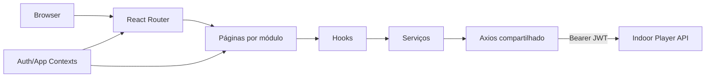

# Arquitetura do painel Web

## Visão geral

O painel é uma SPA React. A aplicação é entregue como arquivos estáticos e todas as operações de negócio são realizadas pela API. Não existe backend próprio do frontend nem renderização no servidor.

## Inicialização e rotas

`src/main.tsx` monta a aplicação e `src/routes/root.tsx` define as rotas. As páginas autenticadas são carregadas com `lazy` e `Suspense`, reduzindo o pacote inicial.

A raiz `/` exibe o login. `/home` usa `ProtectedRoute` e redireciona para `/home/dashboard`. `RoleProtectedRoute` protege auditoria para `OWNER` e `ADMIN`. O menu aplica a mesma visibilidade a usuários e auditoria.

O controle no cliente melhora a experiência, mas a autorização efetiva permanece na API.

## Estado global

| Contexto          | Responsabilidade                                  |
| ----------------- | ------------------------------------------------- |
| `AuthContext`     | token, usuário, login, logout e perfil            |
| `AppContext`      | feedback e recursos globais da interface          |
| `HelpTourContext` | reinício da apresentação guiada a partir da Ajuda |

O token `@TOKEN` e o objeto `user` ficam em cookies por um dia, com `SameSite=Strict`. O token é lido pelo interceptor Axios e incluído como bearer. Uma resposta `401`, exceto no próprio login, remove os cookies e solicita nova autenticação.

## Organização por módulo

Cada pasta em `src/app/(auth)` concentra, quando aplicável:

- página `index.tsx`;
- componentes específicos;
- hooks de consulta e estado;
- serviços HTTP;
- tipos TypeScript;
- testes próximos ao comportamento testado.

O compartilhamento visual fica em `src/components`. Utilitários sem vínculo com uma tela ficam em `src/lib`.

## Fluxo de dados

1. A página chama um hook do módulo.
2. O hook gerencia loading, erro, estado e ações.
3. O serviço usa a instância Axios compartilhada.
4. A API retorna dados já isolados por empresa.
5. O hook atualiza a interface e apresenta feedback.

O dashboard usa `Promise.allSettled` para manter indicadores disponíveis quando apenas uma das consultas falha.

## Ajuda e primeiro acesso

O módulo `src/app/(auth)/Help` mantém o conteúdo do manual, as perguntas frequentes e as etapas do tour. No primeiro acesso de cada usuário, `Home` abre a apresentação e grava localmente a versão concluída. Alterar `ONBOARDING_VERSION` permite apresentar uma nova versão do guia a quem já concluiu uma anterior.

Cada etapa pode informar uma rota, um atributo `data-help-tour` e ações opcionais para abrir ou fechar uma interface. O componente navega para a tela, abre modais de criação sem enviar formulários, espera o alvo ficar disponível, desloca-o para a área visível e monta quatro camadas ao redor do elemento para criar o destaque. A explicação é posicionada no espaço disponível e uma seta indica o controle. Etapas de usuários e auditoria são removidas para operadores pela mesma regra de perfil usada no menu.

A rota interna `/home/playlist-guide` apresenta uma composição não persistente com dados ilustrativos. Ela garante que o tour possa explicar ordem, duração de imagens, duração e áudio de vídeos e associação de barras mesmo quando a empresa ainda não cadastrou nenhuma playlist. O modal de agendamento também apresenta rótulos ilustrativos quando não existem Players ou playlists, sem tornar esses exemplos selecionáveis ou enviá-los à API.

O tour é apenas informativo: a camada de destaque impede cliques acidentais nas funções enquanto a apresentação está ativa. O usuário pode avançar, voltar, pular, fechar com `Esc` e executar novamente o guia pela rota `/home/help`.

## Prévia de conteúdo

O Web possui duas prévias diferentes:

- prévia de edição: simula orientação, barras, textos, imagens e widgets antes de salvar;
- prévia do dispositivo: usa o estado reportado por heartbeat e os dados retornados por `/devices/:id/preview`.

Os cálculos de barra reproduzem as mesmas referências de layout do Player, mas o navegador não simula particularidades de overscan ou firmware da TV. Mudanças nessa regra devem atualizar e testar Web e Android em conjunto.

## Regras de playlist na interface

- imagens exibem controle de duração;
- vídeos mostram duração somente leitura, definida pelo arquivo;
- vídeo sem faixa de áudio permanece silenciado e não permite alteração;
- reordenação usa `dnd-kit` e é persistida pela API;
- barras reutilizáveis são associadas na tela de detalhes.

## Tratamento de ambiente

`src/lib/environment.ts` remove barras finais e usa:

- `VITE_BASE_URL_API`, padrão `http://localhost:3000`;
- `VITE_BASE_URL_API_FILES`, padrão `${VITE_BASE_URL_API}/files/indoor-player-api`.

Como variáveis `VITE_*` são públicas no bundle, nunca coloque senhas, tokens ou segredos nelas.

## Qualidade

O comando `npm run validate` verifica Prettier, TypeScript e ESLint, executa os testes e gera o build. Componentes com regra crítica possuem testes de permissão, playlist, preview, barras, dispositivos, auditoria e página 404.

## Requisitos do servidor estático

- HTTPS;
- fallback para `index.html`;
- cache longo para assets com hash e cache curto para `index.html`;
- compressão Brotli ou gzip;
- headers de segurança;
- acesso permitido à origem da API por CORS;
- nova build quando as URLs `VITE_*` mudarem.
